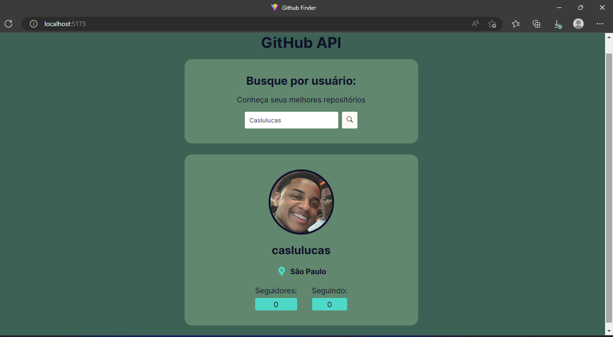

In the project directory, you can run:

###  `npm install` 

Install dependencies for API simulator

### `npm dev`

Runs the app in the development mode.\
Open [http://localhost:5173/](http://localhost:5173/) to view it in your browser.

## Tecnologies

- REACT
- VITE
- TYPESCRIPT
- HTML
- CSS
- Git E Github

